<p align="center">
    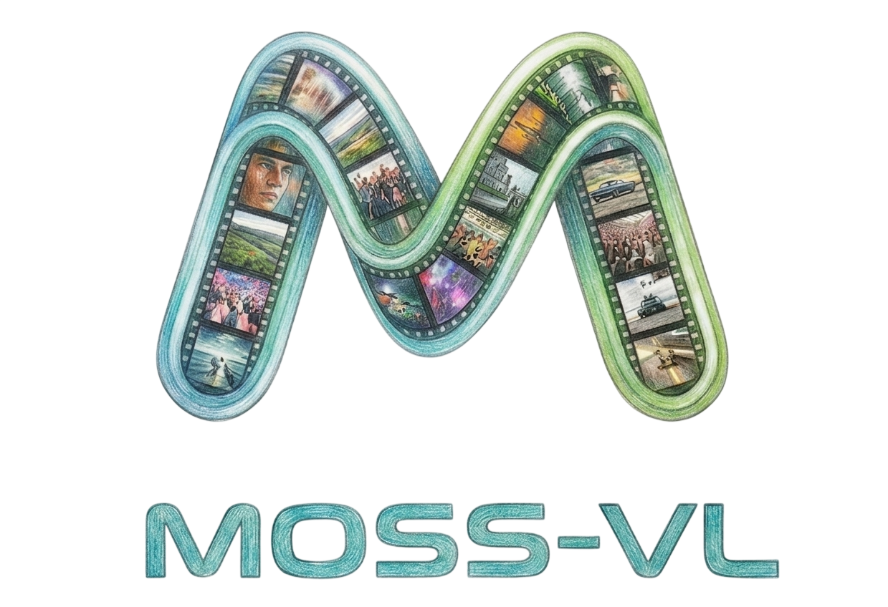
</p>

<div align="center">
    <a href="https://github.com/OpenMOSS/MOSS-VL"></a>
    <a href="https://huggingface.co/collections/OpenMOSS-Team/moss-vl"></a>
    <a href="https://modelscope.cn/collections/openmoss/MOSS-VL"></a>
    <br>
    <a href="https://OpenMOSS.github.io/MOSS-VL-Demo/#/"></a>
    <a href="#"></a>
    <a href="./LICENSE"></a>
    <a href="assets/wechat.jpg"></a>

</div>

<p align="center">
    <a href="./README.md"><b>English</b></a> | <a href="./README_zh.md"><b>中文</b></a>
</p>

## MOSS-VL

**MOSS-VL** is the core multimodal model series within the OpenMOSS ecosystem, dedicated to advancing visual understanding. To tackle the inherent complexities of video comprehension, our roadmap pursues a systematic scaling strategy along three key dimensions:     

- 📈 **Data Scaling**: Curating massive-scale, high-quality multimodal datasets to drive robust generalization.
- 🧠 **Parameter Scaling**: Expanding model capacity to capture intricate vision-language correlations.
- ⏳ **Context Scaling**: Extending temporal horizons to enable reasoning over long-form video content.

---

## 📌 Table of Contents
- [🔥 News](#-news)
- [🏗️ Model Architecture](#️-model-architecture)
- [🧩 Absolute Timestamps](#-absolute-timestamps)
- [🧬 Cross-attention RoPE (XRoPE)](#-cross-attention-rope-xrope)
- [🎬 Demo](#-demo)
- [📊 Training Strategy](#-training-strategy)
- [📊 Evaluation Results](#-evaluation-results)
- [🚀 Quick Start](#-quick-start)
- [📥 Model Download](#-model-download)
- [📑 Roadmap & TODO List](#-roadmap--todo-list)
- [📜 Citation](#-citation)

---

## 🔥 News
- **2026/04/08**: 🚀 Released MOSS-VL-Base-0408 and MOSS-VL-Instruct-0408.
- **2026/04/03**: 🏆 Finished both pre-training and SFT for MOSS-VL.
- **2025/10/18**: 🔍 Kicked off the MOSS-VL project. 
- **2025/09/30**: ✨ Finished training [MOSS-Video-Preview](https://github.com/fnlp-vision/MOSS-Video-Preview) .

## 🏗️ Model Architecture
**MOSS-VL** adopts a cross-attention-based architecture that decouples visual encoding from cognitive reasoning. This design significantly reduces latency, enabling instantaneous responses to dynamic video streams. Natively supporting **interleaved modalities**, it processes complex sequences of images and videos within a unified pipeline — eliminating the need for heavy pre-processing.
    
<p align="center">
    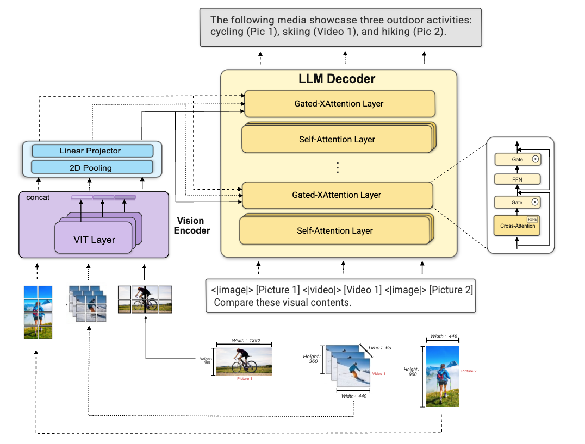
    <br>
    <em>Figure 1: Overall architecture of MOSS-VL.</em>
</p>

---

## 🧩 Absolute Timestamps

To ensure the model accurately perceives the pacing and duration of events, **MOSS-VL** injects **absolute timestamps** alongside each sampled frame, grounding the reasoning process in a **precise temporal reference**.

### 📥 Input Representation

<p align="center">
    
    <br>
    <em>Figure 2: Illustration of timestamped video sequence input.</em>
</p>

Each video is interleaved with **precise time markers**, where each timestamp is wrapped by **dedicated special tokens** (`<|time_start|>` … `<|time_end|>`) that explicitly anchor the **temporal location** of every visual frame:

```text
<|im_start|><|vision_start|>
<|time_start|>0.0 seconds<|time_end|><|image_pad|>
<|time_start|>1.2 seconds<|time_end|><|image_pad|>
<|time_start|>2.3 seconds<|time_end|><|image_pad|>
...
<|vision_end|>The video shows a dynamic scene with continuous actions...<|im_end|>
```

**🌟 Why this matters:**
- **Adaptability to Variable FPS:** The use of explicit timestamps allows the model to handle non-uniform sampling rates without loss of temporal context.
- **Precise Temporal Analysis:** Absolute time unlocks fine-grained action localization, grounding every response in exact temporal coordinates. 
- **Motion Dynamics:** By exposing time intervals ($dt$), the model can reason about movement physics, enabling accurate estimation of velocity, acceleration, and trajectory.

---

## 🧬 Cross-attention RoPE (XRoPE)

MOSS-VL utilizes Cross-attention Rotary Position Embedding (XRoPE), tailored to its cross-attention based vision–language architecture. This mechanism maps text tokens and video patches into a unified 3D coordinate space defined by Time (t), Height (h), and Width (w).


<p align="center">
    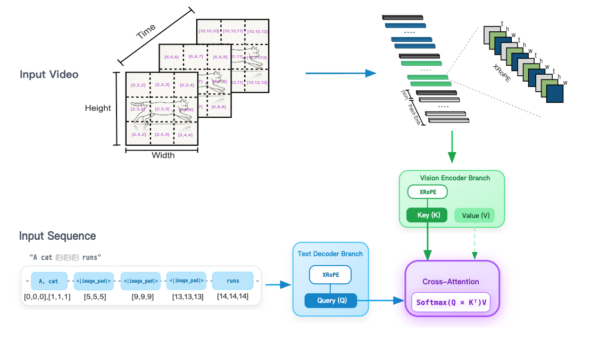
    <br>
    <em> Figure 3: MOSS-VL with Cross-attention RoPE (XRoPE).</em>
</p>

To optimize cross-modal alignment, **XRoPE** is injected into the vision **Key (K)** for position-awareness while leaving the **Value (V)** untouched to preserve feature fidelity. In parallel, it is applied to the text **Query (Q)**, allowing the model to probe arbitrary spatio-temporal regions through direct coordinate alignment.

**🌟 Why this matters**

- **Unified Modality Modeling** — By expressing time as a shared dimension across both language and video, **XRoPE** enables seamless, cohesive video-text reasoning within a single coordinate system.
- **Precise Grounding** — Aligned ($t, h, w$) coordinates empower the model to localize small objects and transient actions anywhere in the 3D video volume — down to the patch and the moment.
- **Dynamic Input Support** — The 3D grid natively accommodates arbitrary aspect ratios and resolutions, eliminating the need for fixed-length padding or rigid input constraints.


---

## 🎬 Demo

<div align="center">
  <video src="https://gist.github.com/user-attachments/assets/66406aaa-f09f-412c-87b1-97753895ef1f
" width="70%" poster="" controls></video>
<video src="https://gist.github.com/user-attachments/assets/d1ccae33-472f-4d92-96c4-fb6253b07189
" width="70%" poster="" controls></video>
  <p align="center">
    For more examples, please visit our <a href="https://OpenMOSS.github.io/MOSS-VL-Demo/#/">Interactive Demo Page</a> 🚀
  </p>
</div>

## 📊 Training Strategy
MOSS-VL is trained using a multi-stage approach to progressively build multimodal capabilities.

<p align="center">
    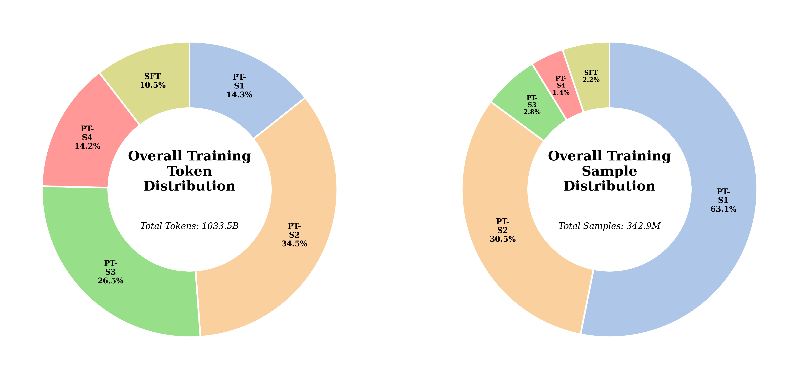
    <br>
    <em>Figure 4: Overall training data distribution of MOSS-VL.</em>
</p>

### Pre-training（PT）
MOSS-VL is pre-trained via a systematic four-stage curriculum that progressively builds up multimodal capabilities from the ground up:

* **Stage 1 — Vision-Language Alignment** — Establishes the initial bridge between visual features and the language space. Training on large-scale image-text pairs, the model learns to associate visual concepts with their textual counterparts while developing foundational OCR skills for text-in-image understanding.

* **Stage 2 — Large-Scale Multimodal Pre-training** — Scales up exposure to massive, diverse multimodal corpora, broadening the model's grasp of world knowledge and complex scenes — laying a robust foundation for general-purpose intelligence and high-resolution perception. In addition, short video clips are introduced at this stage to seed preliminary video understanding.

* **Stage 3 — High-Quality Multimodal Pre-training** — Elevates overall model quality by training on large volumes of high-quality perception, understanding, and reasoning data. This phase combines fine-grained image perception, complex multi-image comprehension, and high-fidelity video reasoning to sharpen the model's ability to capture intricate visual details and master temporal relationships across rich multimodal inputs.

* **Stage 4 — Annealing & Long-Context Extrapolation** — Stretches the model's horizon toward long-form video understanding, while a carefully designed annealing schedule trains on curated, top-tier multimodal data to push final performance to its peak.

| Stage | Strategy | Data Composition |
| :--- | :--- | :--- |
| **1** | **Vision-Language Alignment** | 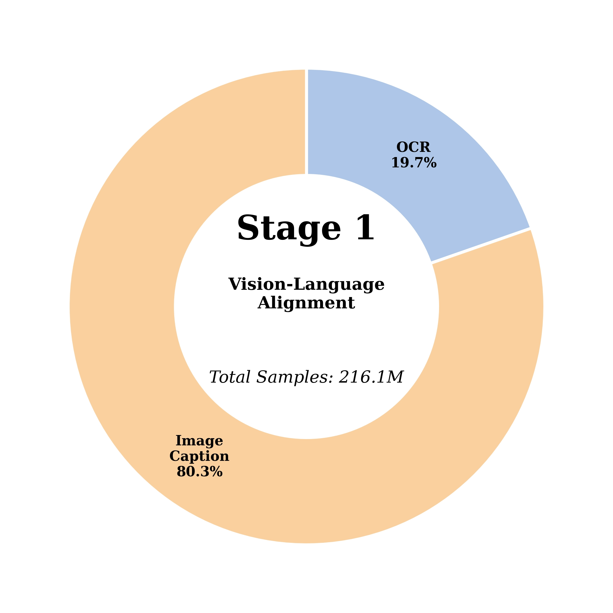 |
| **2** | **Large-Scale Multimodal Pre-training** | 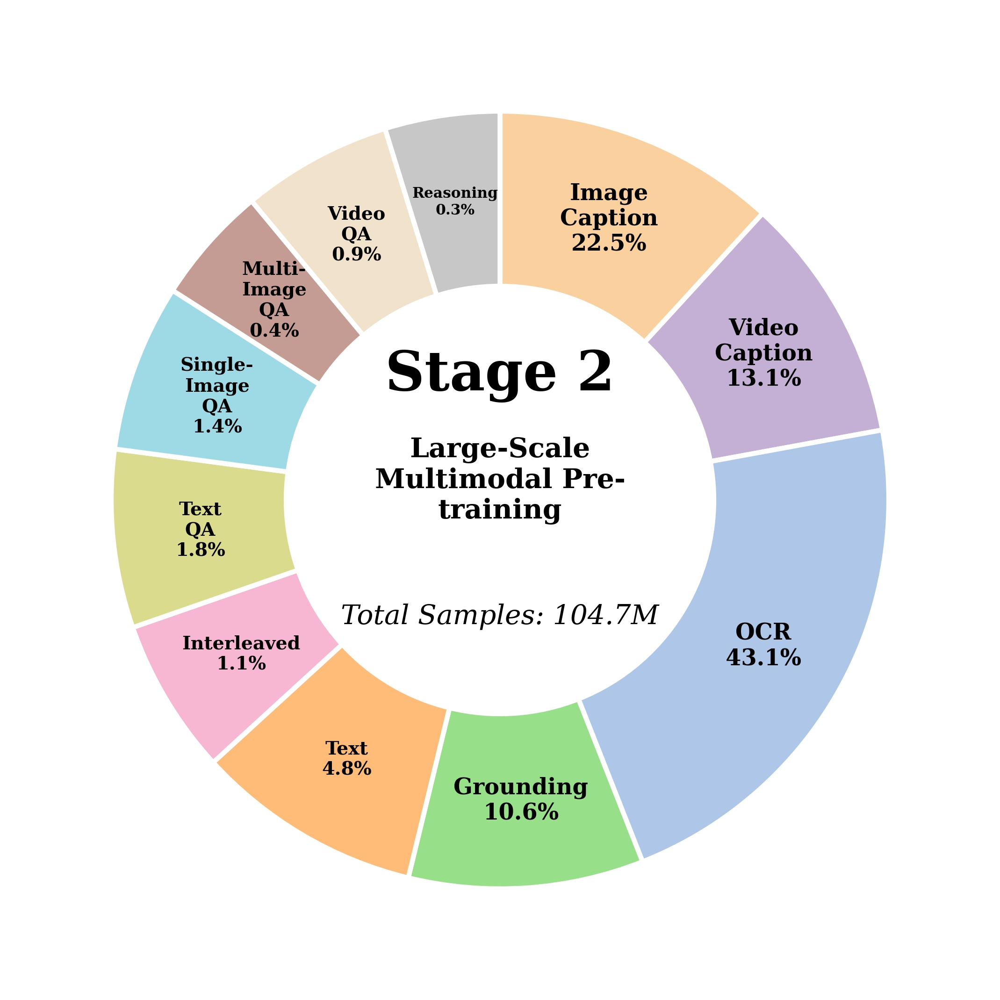 |
| **3** | **High-Quality Multimodal Pre-training** | 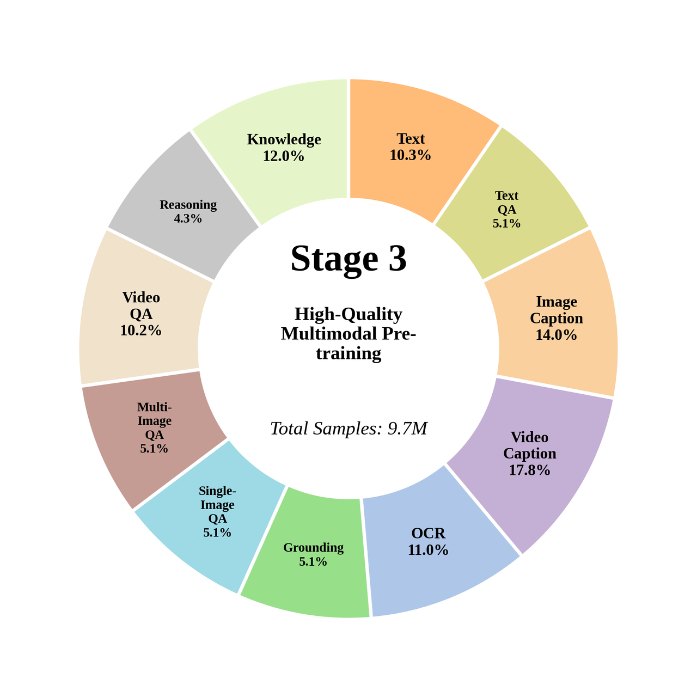 |
| **4** | **Annealing & Long-Context Extrapolation** | 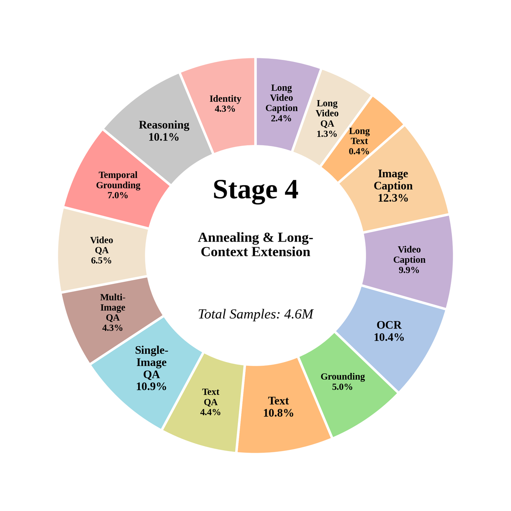 |


### Supervised Fine-Tuning (SFT)
Building on the pre-trained foundation, **MOSS-VL** is further refined through **Supervised Fine-Tuning (SFT)** to align with human intent and unlock its full interactive and instruction-following capabilities.

<p align="center">
    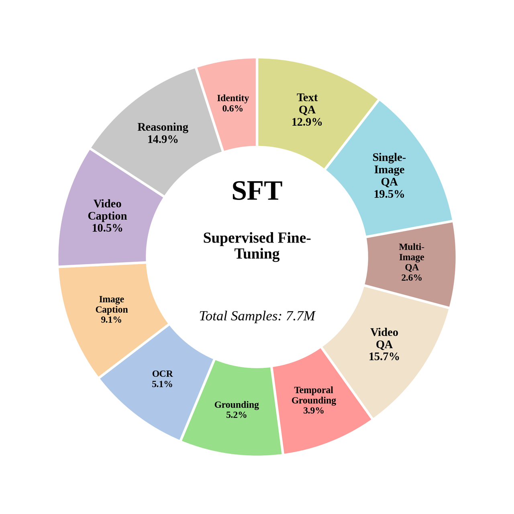
    <br>
    <em>Figure 5: Data composition of MOSS-VL SFT.</em>
</p>


### Reinforcement Learning from Human Feedback (RLHF)

> [!NOTE]
> MOSS-VL is currently undergoing RLHF training. Stay tuned for updates.


---


## 📊 Evaluation Results
We conducted a comprehensive evaluation of MOSS-VL across four key dimensions: Multimodal Perception, Multimodal Reasoning,Document/OCR, and Video Understanding. The results demonstrate that MOSS-VL achieves outstanding performance, particularly excelling in **general multimodal perception** and **complex video analysis**.

### Overall Performance

The table below reports benchmark scores on a 0–100 scale. Across the board, MOSS-VL consistently ranks first or second when compared against industry-leading baselines such as Qwen2.5-VL and Qwen3-VL. 


<p align="center">
    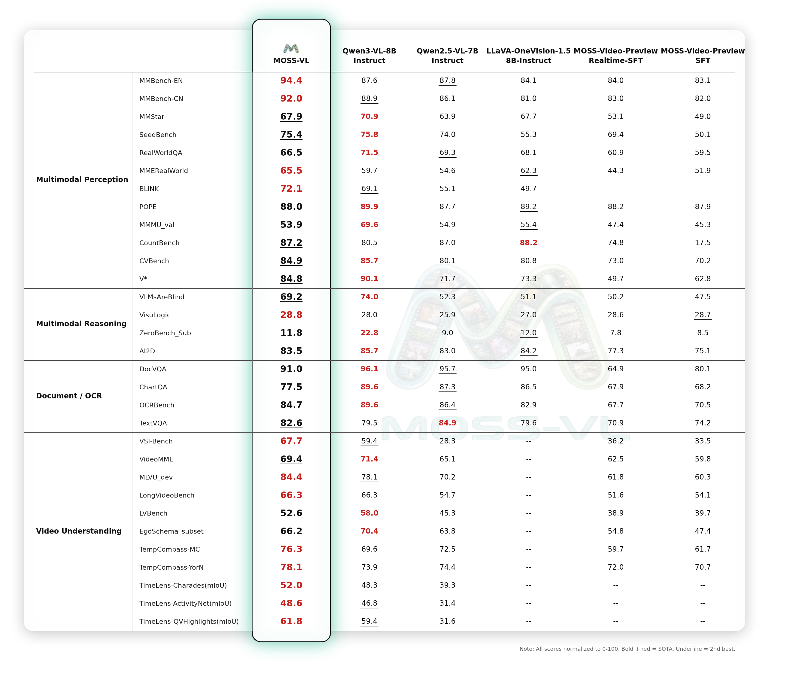
    <br>
    <em>Figure 6: Detailed benchmark comparison between MOSS-VL and Qwen series.</em>
</p>

### Key Highlights

*   **🚀 Leading Video Intelligence**: MOSS-VL achieves a score of **65.8** in Video Understanding, significantly outperforming Qwen3-VL (+2pts). It shows exceptional temporal consistency and action recognition capabilities across benchmarks like `VideoMME`, `MLVU`, `EgoSchema`, and `VSI-bench` (where it outperforms **Qwen3-VL-8B-Instruct** by **8.3 points**).
*   **👁️ Outstanding Multimodal Perception**: MOSS-VL delivers excellent general image-text understanding, shining in fine-grained object recognition and spatial reasoning on benchmarks like `BLINK` and `MMBench`.
*   **🧠 Robust Multimodal Reasoning**: MOSS-VL demonstrates solid logical inference, staying highly competitive with the latest Qwen series on challenging reasoning suites such as `CVBench` and `VisuLogic`.
*   **📄 Reliable Document Understanding**: While the model is primarily optimized for general perception and video, MOSS-VL still delivers **83.9** on OCR and document analysis, ensuring dependable extraction of text and structured information.

### Benchmark Analysis

The chart below visualizes MOSS-VL's balanced and well-rounded capability profile across 30+ specialized benchmarks. Represented by the solid blue region, MOSS-VL achieves the broadest overall coverage, with particularly strong showings in the Video Understanding and Multimodal Perception quadrants.

<p align="center">
  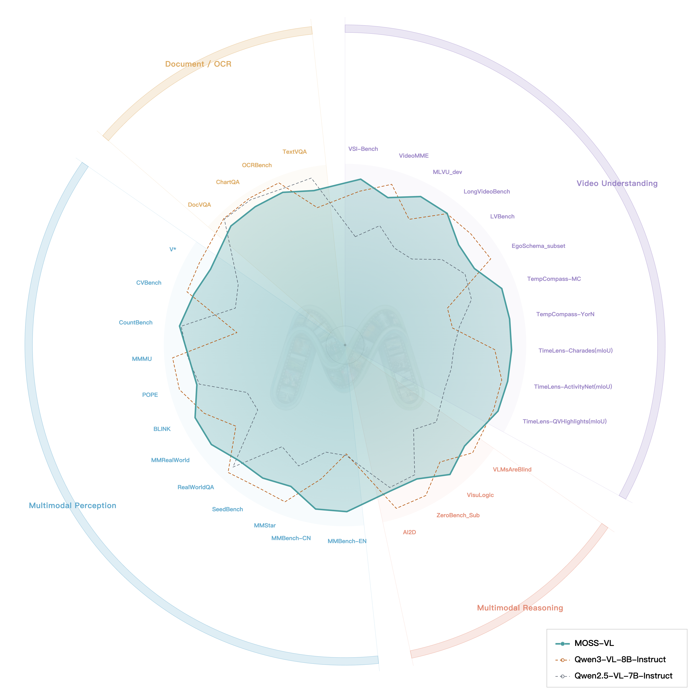
  <br>
  <em>Figure 7: Benchmark analysis of MOSS-VL.</em>
</p>

---


## 🚀 Quick Start

### Environment Setup
```bash
conda create -n moss_vl python=3.12 pip -y
conda activate moss_vl
pip install -i https://pypi.org/simple --no-build-isolation -r requirements.txt
```

### Run Inference

For complete runnable examples and demo assets, see [`inference/README.md`](inference/README.md).
Inference supports full-modality offline queries, including pure text, single/multi-image, single/multi-video, and interleaved image-video inputs in the `messages` format.

<details>
<summary><strong>Single-query inference with <code>offline_generate</code></strong></summary>

<br>

```python
import queue
import threading
import torch
from transformers import AutoModelForCausalLM, AutoProcessor

checkpoint = "/path/to/dummy-checkpoint"

processor = AutoProcessor.from_pretrained(
    checkpoint,
    trust_remote_code=True,
    frame_extract_num_threads=1,
)
model = AutoModelForCausalLM.from_pretrained(
    checkpoint,
    trust_remote_code=True,
    device_map="auto",
    torch_dtype=torch.bfloat16,
    attn_implementation="flash_attention_2",
)

query = {
    "messages": [
        {
            "role": "user",
            "content": [
                {"type": "image", "image": "path/to/example.jpg"},
                {"type": "text", "text": "Describe this image."},
            ],
        }
    ],
    "media_kwargs": {},
    "generate_kwargs": {
        "max_new_tokens": 256,
        "do_sample": False,
        "vision_chunked_length": 64,
    },
}

input_queue = queue.Queue()
output_queue = queue.Queue()
worker = threading.Thread(
    target=model.offline_generate,
    args=(processor, input_queue, output_queue),
    kwargs={"vision_chunked_length": 64},
    daemon=True,
)
worker.start()

input_queue.put(query)
text_chunks = []
while True:
    item = output_queue.get()
    if item in {"<|round_start|>"}:
        continue
    if item == "<|round_end|>":
        break
    text_chunks.append(item)

print("".join(text_chunks))

input_queue.put({"stop_offline_generate": True})
worker.join()
```

</details>

For simple batched offline inference, you can also use `offline_batch_generate`:

<details>
<summary><strong>Batched inference with <code>offline_batch_generate</code></strong></summary>

<br>

```python
import torch
from transformers import AutoModelForCausalLM, AutoProcessor

checkpoint = "/path/to/dummy-checkpoint"

processor = AutoProcessor.from_pretrained(
    checkpoint,
    trust_remote_code=True,
    frame_extract_num_threads=1,
)
model = AutoModelForCausalLM.from_pretrained(
    checkpoint,
    trust_remote_code=True,
    device_map="auto",
    torch_dtype=torch.bfloat16,
    attn_implementation="flash_attention_2",
)

queries = [
    {
        "messages": [
            {
                "role": "user",
                "content": [{"type": "text", "text": "Describe sample A."}],
            }
        ],
        "media_kwargs": {},
        "generate_kwargs": {"max_new_tokens": 256, "do_sample": False},
    },
    {
        "messages": [
            {
                "role": "user",
                "content": [{"type": "text", "text": "Describe sample B."}],
            }
        ],
        "media_kwargs": {},
        "generate_kwargs": {"max_new_tokens": 256, "do_sample": False},
    },
]

with torch.no_grad():
    result = model.offline_batch_generate(
        processor,
        queries,
        vision_chunked_length=64,
    )

texts = [item["text"] for item in result["results"]]
print(texts)
```

</details>

### Run Fine-Tuning

We provide a lightweight SFT framework built on HuggingFace `transformers.Trainer`. It supports full-parameter training, LoRA, with the vision encoder, language model, and LM head independently controllable.

```bash
# Full-parameter SFT (vision encoder frozen by default)
bash mossvl_finetune/scripts/run_sft.sh

# LoRA SFT
pip install -i https://pypi.org/simple peft
bash mossvl_finetune/scripts/run_sft_lora.sh
```

Training data uses a simple JSON format compatible with the inference query structure — just add a `response` field:

```json
[
  {
    "prompt": "Describe this image.",
    "response": "A beautiful landscape with mountains.",
    "images": ["path/to/image.jpg"],
    "videos": []
  }
]
```

**Multi-turn conversations are also supported.** See [`mossvl_finetune/README.md`](mossvl_finetune/README.md) for full documentation.

---

## 📥 Model Download 

| Model | 🤗Download Link | 🤖ModelScope Link |
| :--- | :--- | :--- |
| **MOSS-VL-Base-0408** | [HuggingFace](https://huggingface.co/OpenMOSS-Team/MOSS-VL-Base-0408) | [ModelScope](https://modelscope.cn/models/openmoss/MOSS-VL-Base-0408) |
| **MOSS-VL-Instruct-0408** | [HuggingFace](https://huggingface.co/OpenMOSS-Team/MOSS-VL-Instruct-0408) | [ModelScope](https://modelscope.cn/models/openmoss/MOSS-VL-Instruct-0408) |


---
## 📑 Roadmap & TODO List

### ✅ Milestones
- [x] **Core Architecture:** Implementation of Cross-attention RoPE (XRoPE).
- [x] **High-performance Infra:** Integrated Megatron-LM + CUDA Flash Attention 3.
- [x] **Model Release:** Open-sourced `MOSS-VL-Base` and `MOSS-VL-Instruct`.
- [x] **Inference:** Inference code for both image and video understanding.

### 🚀 Upcoming
- [ ] **Training Engine:** Full training code for MOSS-VL.
- [ ] **Real-time Capabilities:** Specialized Real-time Video Understanding Model.
- [ ] **RL Post-training:** Reinforcement Learning for MOSS-VL series.
- [ ] **Documentation:** Comprehensive Technical Report.

---

## 🤝 Acknowledgement
We would like to express our gratitude to **NVIDIA** for the [Megatron-LM](https://github.com/NVIDIA/Megatron-LM) framework and the **Qwen Team** for their powerful [Qwen](https://github.com/QwenLM/Qwen) series language models, which serve as the foundation of our training infrastructure and core LLM.

## 📜 Citation
```bibtex
@misc{moss_vl_2026,
  title         = {{MOSS-VL Technical Report}},
  author        = {OpenMOSS Team},
  year          = {2026},
  howpublished  = {\url{https://github.com/OpenMOSS/MOSS-VL}},
  note          = {GitHub repository}
}
```

## 🌟 Star History

<a href="https://www.star-history.com/?repos=OpenMOSS%2FMOSS-VL&type=date&legend=top-left">
 <picture>
   <source media="(prefers-color-scheme: dark)" srcset="https://api.star-history.com/chart?repos=OpenMOSS/MOSS-VL&type=date&theme=dark&legend=top-left" />
   <source media="(prefers-color-scheme: light)" srcset="https://api.star-history.com/chart?repos=OpenMOSS/MOSS-VL&type=date&legend=top-left" />
   
 </picture>
</a>

<p align="center">
Built with ❤️ by the <b>OpenMOSS Team</b>
</p>

